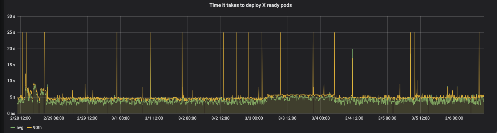
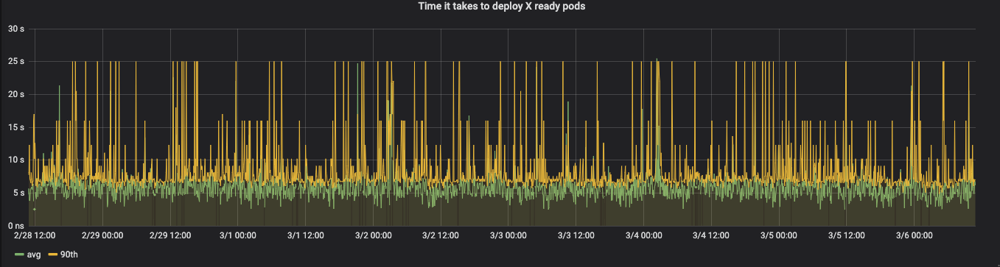

# Introduction

Some time in 2019 we experienced a nasty incident. During a GKE patch-level upgrade all evicted / rescheduled pods got status pending and stayed in that state. The upgrade continued (yes, we should've canceled it, but that's hindsight wisdom) slowly killing all applications. Finally we recovered by manually scaling all Deployments to zero replicas followed by a scaleup to the expected number of replicas. That triggered the scheduler to schedule the pods on nodes. During the post-mortem we decided to make several improvements. One of them was building a quick & dirty monitoring tool to provide us with metrics for alerting on slow or broken down scheduling.

This tool is called: `k8s-scheduler-tester`. It is a Kubernetes native tool used to monitor the time it takes for Kubernetes to deployment multiple new pods.

## How it works

Monitoring is done by repeating the following flow every X seconds:

- start timer
- create a fresh Deployment for N 'canary' pods and anti-affinity to ensure pods get deployed on different nodes
- wait for all pods to become ready, or timeout
- calculate elapsed time and add it to a Prometheus Histogram
- delete the Deployment terminating the pods created
- expose the elapsed time

# Demo

You will find a [Kind](https://kind.sigs.k8s.io/) (Kubernetes in Docker) powered multi-node Kubernetes test suite in the `example/` directory.

- Run `setup.sh` to create a local Kubernetes cluster and deploy `k8s-scheduler-tester.
- Run `test.sh` to exec into the tester container and request the metrics endpoint.
- Run `teardown.sh` to destroy your local Kubernetes cluster.

# Build

Use `docker build -t k8s-scheduler-tester .` to build the Docker image.

Or use the [`rtoma/k8s-scheduler-tester`](https://hub.docker.com/repository/docker/rtoma/k8s-scheduler-tester) Docker image on Docker Hub.

# Deploy

Have a look in the `example/` directory for a complete Kubernetes manifest.

# Security

Since `k8s-scheduler-tester` creates/deletes new Deployments the used Kubernetes serviceaccount requires permissions. Following role rules should do the trick:

```yaml
- apiGroups:
  - apps
  resources:
  - deployments
  verbs:
  - create
  - delete
  - list
  - watch
```

For full ClusterRole and RoleBinding examples, have a look at the `examples/` directory.

# Configuration

`k8s-scheduler-tester` can be configured using arguments or environment variables.

```bash
$ docker run --rm k8s-scheduler-tester -h
Usage: tester.py [OPTIONS]

Options:
  -d, --debug                Enable DEBUG verbosity
  -w, --wirelog              Enable Kubernetes DEBUG + wire logging
  -t, --timeout INTEGER      Deployment timeout (stops waiting for ready
                             pods). Default: 30
  --prometheus-port INTEGER  Prometheus HTTP listener port. Default: 9999
  --target-namespace TEXT    Target Kubernetes namespace to create deployment
                             in  [required]
  -i, --interval INTEGER     Metric collection interval in seconds. Default:
                             30
  --context TEXT             Kubernetes context to use (for local development
  -s, --single               Do a single run and exit (for local development)
  -r, --replicas INTEGER     Number of replicas to deploy. Default: 3
  --keep INTEGER             Keep pods running for X seconds. Default:
                             {DEFAULT_KEEP}
  --image TEXT               Container image to deploy. Default:
                             gcr.io/projectcalico-org/node:v3.2.7  [required]
  --args TEXT                Container arguments. Comma separated. Default:
                             sleep,999  [required]
  --cpu-limit TEXT           Container CPU limit (also used as requests).
                             Comma separated. Default: 100m  [required]
  --memory-limit TEXT        Container memory limit (also used as requests).
                             Comma separated. Default: 50Mi  [required]
  -h, --help                 Show this message and exit.
  ```

## Environment variables

Check out the `kubernetes/deployment.yaml` for an example of configuration using environment variables.
The environment variable names are like the command line parameter names with an `OPT_` prefix.
Example: set `OPT_TARGET_NAMESPACE=foo` is similar to passing `--target_name foo`.

# Run

Once the `k8s-scheduler-tester` has been deployed, the pod will start running the monitoring loop.

## Troubleshooting

Check the `k8s-scheduler-tester` log. Here are some diagnostic questions that may help:

- Is the tester Pod in a 'Running' state? If not, describe the Pod, Replicaset or Deployment. Checking the events never hurts.
- Is the tester able to create new Deployments, Replicasets and Pods? Does the service account used have enough permissions?
- Is it trying to create the resources in the correct namespace?

# Metrics exposed

Prometheus can scrape metrics on the `k8s-scheduler-tester` IP port 9999 (or as specified via the argument or env var).

Example of the metrics exposed (excluding the generic prometheus python client metrics):

```
# HELP k8s_scheduler_tester_config_info Tester configuration
# TYPE k8s_scheduler_tester_config_info gauge
k8s_scheduler_tester_config_info{interval_sec="30",keep_running_sec="1",replicas="3",test_args="sleep,999",test_image="gcr.io/projectcalico-org/node:v3.2.7",test_timout="60",version="1.1.0"} 1.0

# HELP k8s_scheduler_tester_time_to_ready_deployment Time between create deployment and all replicas in ready state
# TYPE k8s_scheduler_tester_time_to_ready_deployment histogram
k8s_scheduler_tester_time_to_ready_deployment_bucket{le="1.0"} 0.0
k8s_scheduler_tester_time_to_ready_deployment_bucket{le="2.0"} 0.0
k8s_scheduler_tester_time_to_ready_deployment_bucket{le="3.0"} 4386.0
k8s_scheduler_tester_time_to_ready_deployment_bucket{le="4.0"} 15220.0
k8s_scheduler_tester_time_to_ready_deployment_bucket{le="5.0"} 36814.0
k8s_scheduler_tester_time_to_ready_deployment_bucket{le="6.0"} 57045.0
k8s_scheduler_tester_time_to_ready_deployment_bucket{le="7.0"} 63597.0
k8s_scheduler_tester_time_to_ready_deployment_bucket{le="8.0"} 64205.0
k8s_scheduler_tester_time_to_ready_deployment_bucket{le="9.0"} 64483.0
k8s_scheduler_tester_time_to_ready_deployment_bucket{le="10.0"} 64675.0
k8s_scheduler_tester_time_to_ready_deployment_bucket{le="12.0"} 64940.0
k8s_scheduler_tester_time_to_ready_deployment_bucket{le="15.0"} 65155.0
k8s_scheduler_tester_time_to_ready_deployment_bucket{le="25.0"} 65358.0
k8s_scheduler_tester_time_to_ready_deployment_bucket{le="+Inf"} 65504.0
k8s_scheduler_tester_time_to_ready_deployment_count 65504.0
k8s_scheduler_tester_time_to_ready_deployment_sum 325005.44763302803

# TYPE k8s_scheduler_tester_time_to_ready_deployment_created gauge
k8s_scheduler_tester_time_to_ready_deployment_created 1.581520429060375e+09

# HELP k8s_scheduler_tester_timeouts_total Tests time out when a deployment did not get all its pods in ready state within X seconds
# TYPE k8s_scheduler_tester_timeouts_total counter
k8s_scheduler_tester_timeouts_total 3.0

# TYPE k8s_scheduler_tester_timeouts_created gauge
k8s_scheduler_tester_timeouts_created 1.5815204290604856e+09
```

Once scraped by Prometheus. You may graph the data using promql queries like:

- avg: `max(rate(k8s_scheduler_tester_time_to_ready_deployment_sum[1m]) / rate(k8s_scheduler_tester_time_to_ready_deployment_count[1m]))`
- 90th: `histogram_quantile(0.9, sum(rate(k8s_scheduler_tester_time_to_ready_deployment_bucket[5m])) by (le))`

And the graphs may look like this.

On a quiet cluster:



And on a busy cluster:



